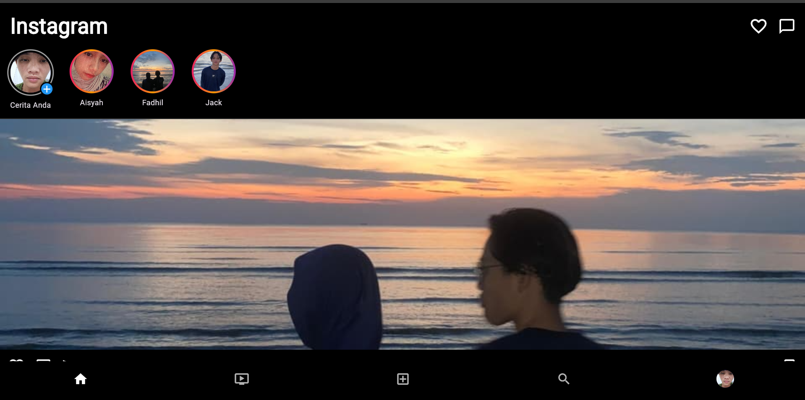

# Tugas UI/UX Flutter — Instagram UI Clone

## Identitas
- **Nama:** Muhammad Syahid Fadhilah
- **NIM:** 2455201110014
- **Pilihan:** B

---

## Deskripsi Singkat
Pada tugas ini saya membuat tampilan aplikasi Instagram sederhana menggunakan Flutter.  
Aplikasi memiliki beberapa halaman utama seperti:

1. **Home Page**  
   Menampilkan feed postingan dan story seperti aplikasi Instagram.

2. **Reels Page**  
   Menampilkan halaman reels/video pendek.

3. **Profile Page**  
   Menampilkan profil pengguna lengkap dengan foto profil, jumlah followers, following, bio, dan grid postingan.

Aplikasi dibuat menggunakan widget-widget dasar Flutter dengan tema dark mode menyerupai Instagram asli.

---

## Widget yang Digunakan

- **Scaffold** — digunakan sebagai struktur utama halaman.
- **AppBar** — digunakan untuk bagian header aplikasi.
- **Column** — digunakan untuk menyusun widget secara vertikal.
- **Row** — digunakan untuk menyusun widget secara horizontal.
- **Container** — digunakan untuk membungkus dan mengatur tampilan widget.
- **Padding** — memberikan jarak antar widget.
- **SizedBox** — memberikan spasi kosong.
- **Text** — menampilkan teks.
- **Icon** — menampilkan ikon.
- **CircleAvatar** — menampilkan foto profil berbentuk lingkaran.
- **Image.asset** — menampilkan gambar dari folder assets.
- **GridView.builder** — membuat tampilan grid postingan profile.
- **SingleChildScrollView** — agar halaman dapat di-scroll.
- **BottomNavigationBar** — navigasi menu bawah aplikasi.
- **ElevatedButton** — membuat tombol interaktif.
- **SnackBar** — menampilkan notifikasi singkat.
- **Navigator** — berpindah antar halaman.

---

# Screenshot

## Home / Feed

## Profile Page

## Tampilan Tambahan

---

# Wireframe

## Wireframe 1

## Wireframe 2

## Wireframe 3

---

## Kesulitan yang Ditemui
Kesulitan yang saya alami adalah saat mengatur navigasi antar halaman menggunakan BottomNavigationBar serta menampilkan beberapa gambar berbeda pada GridView profile.  

Saya mengatasinya dengan menggunakan Navigator.pushReplacement() untuk perpindahan halaman dan membuat List<String> untuk menyimpan beberapa gambar postingan agar dapat ditampilkan secara dinamis.
